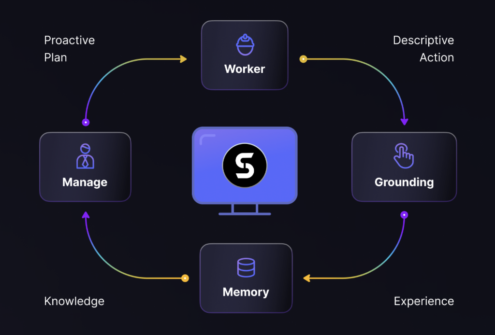
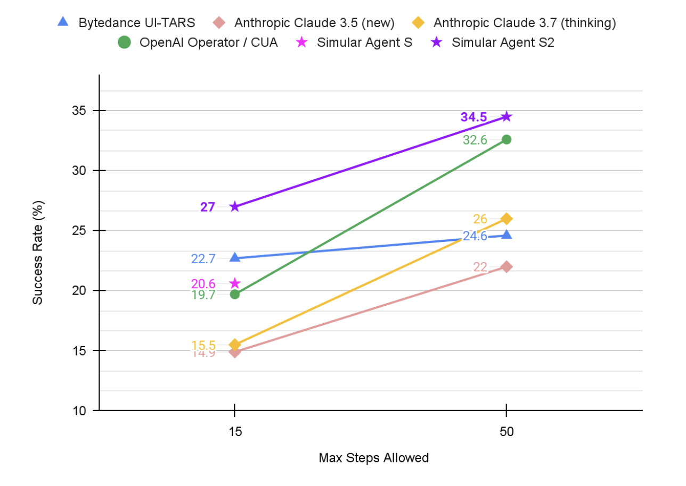

<h1 align="center">
   Agent S2:
  <small>A Compositional Generalist-Specialist Framework for Computer Use Agents</small>
</h1>

<p align="center">&nbsp;
  🌐 <a href="https://www.simular.ai/articles/agent-s2-technical-review">[S2 blog]</a>&nbsp;
  📄 <a href="https://arxiv.org/abs/2504.00906">[S2 Paper]</a>&nbsp;
  🎥 <a href="https://www.youtube.com/watch?v=wUGVQl7c0eg">[S2 Video]</a>
</p>

<p align="center">&nbsp;
  🌐 <a href="https://www.simular.ai/agent-s">[S1 blog]</a>&nbsp;
  📄 <a href="https://arxiv.org/abs/2410.08164">[S1 Paper (ICLR 2025)]</a>&nbsp;
  🎥 <a href="https://www.youtube.com/watch?v=OBDE3Knte0g">[S1 Video]</a>
</p>

<p align="center">&nbsp;
<a href="https://trendshift.io/repositories/13151" target="_blank"></a>
</p>

<p align="center">
  <a href="https://discord.gg/E2XfsK9fPV">
    
  </a>
  &nbsp;&nbsp;
  <a href="https://pepy.tech/projects/gui-agents">
    
  </a>
</p>

## 🥳 Updates
- [x] **2025/04/01**: Released <a href="https://arxiv.org/abs/2504.00906">Agent S2 paper</a> with new SOTA results on OSWorld, WindowsAgentArena, and AndroidWorld!
- [x] **2025/03/12**: Released Agent S2 along with v0.2.0 of [gui-agents](https://github.com/simular-ai/Agent-S), the new state-of-the-art for computer use agents (CUA), outperforming OpenAI's CUA/Operator and Anthropic's Claude 3.7 Sonnet Computer-Use!
- [x] **2025/01/22**: The [Agent S paper](https://arxiv.org/abs/2410.08164) is accepted to ICLR 2025!
- [x] **2025/01/21**: Released v0.1.2 of [gui-agents](https://github.com/simular-ai/Agent-S) library, with support for Linux and Windows!
- [x] **2024/12/05**: Released v0.1.0 of [gui-agents](https://github.com/simular-ai/Agent-S) library, allowing you to use Agent-S for Mac, OSWorld, and WindowsAgentArena with ease!
- [x] **2024/10/10**: Released the [Agent S paper](https://arxiv.org/abs/2410.08164) and codebase!

## Table of Contents

1. [💡 Introduction](#-introduction)
2. [🎯 Current Results](#-current-results)
3. [🛠️ Installation & Setup](#%EF%B8%8F-installation--setup) 
4. [🚀 Usage](#-usage)
5. [🤝 Acknowledgements](#-acknowledgements)
6. [💬 Citation](#-citation)

## 💡 Introduction

<p align="center">
    
</p>

Welcome to **Agent S**, an open-source framework designed to enable autonomous interaction with computers through Agent-Computer Interface. Our mission is to build intelligent GUI agents that can learn from past experiences and perform complex tasks autonomously on your computer. 

Whether you're interested in AI, automation, or contributing to cutting-edge agent-based systems, we're excited to have you here!

## 🎯 Current Results

<p align="center">
    
    <br>
    Results of Agent S2's Successful Rate (%) on the OSWorld full test set using Screenshot input only.
</p>

<div align="center">
  <table border="0" cellspacing="0" cellpadding="5">
    <tr>
      <th>Benchmark</th>
      <th>Agent S2</th>
      <th>Previous SOTA</th>
      <th>Δ improve</th>
    </tr>
    <tr>
      <td>OSWorld (15 step)</td>
      <td>27.0%</td>
      <td>22.7% (UI-TARS)</td>
      <td>+4.3%</td>
    </tr>
    <tr>
      <td>OSWorld (50 step)</td>
      <td>34.5%</td>
      <td>32.6% (OpenAI CUA)</td>
      <td>+1.9%</td>
    </tr>
    <tr>
      <td>WindowsAgentArena</td>
      <td>29.8%</td>
      <td>19.5% (NAVI)</td>
      <td>+10.3%</td>
    </tr>
    <tr>
      <td>AndroidWorld</td>
      <td>54.3%</td>
      <td>46.8% (UI-TARS)</td>
      <td>+7.5%</td>
    </tr>
  </table>
</div>


## 🛠️ Installation & Setup

> ❗**Warning**❗: If you are on a Linux machine, creating a `conda` environment will interfere with `pyatspi`. As of now, there's no clean solution for this issue. Proceed through the installation without using `conda` or any virtual environment.

> ⚠️**Disclaimer**⚠️: To leverage the full potential of Agent S2, we utilize [UI-TARS](https://github.com/bytedance/UI-TARS) as a grounding model (7B-DPO or 72B-DPO for better performance). They can be hosted locally, or on Hugging Face Inference Endpoints. Our code supports Hugging Face Inference Endpoints. Check out [Hugging Face Inference Endpoints](https://huggingface.co/learn/cookbook/en/enterprise_dedicated_endpoints) for more information on how to set up and query this endpoint. However, running Agent S2 does not require this model, and you can use alternative API based models for visual grounding, such as Claude.

Install the package:
```
pip install gui-agents
```

Set your LLM API Keys and other environment variables. You can do this by adding the following line to your .bashrc (Linux), or .zshrc (MacOS) file. 

```
export OPENAI_API_KEY=<YOUR_API_KEY>
export ANTHROPIC_API_KEY=<YOUR_ANTHROPIC_API_KEY>
export HF_TOKEN=<YOUR_HF_TOKEN>
```

Alternatively, you can set the environment variable in your Python script:

```
import os
os.environ["OPENAI_API_KEY"] = "<YOUR_API_KEY>"
```

We also support Azure OpenAI, Anthropic, Gemini, Open Router, and vLLM inference. For more information refer to [models.md](models.md).

### Setup Retrieval from Web using Perplexica
Agent S works best with web-knowledge retrieval. To enable this feature, you need to setup Perplexica: 

1. Ensure Docker Desktop is installed and running on your system.

2. Navigate to the directory containing the project files.

   ```bash
    cd Perplexica
    git submodule update --init
   ```

3. Rename the `sample.config.toml` file to `config.toml`. For Docker setups, you need only fill in the following fields:

   - `OPENAI`: Your OpenAI API key. **You only need to fill this if you wish to use OpenAI's models**.
   - `OLLAMA`: Your Ollama API URL. You should enter it as `http://host.docker.internal:PORT_NUMBER`. If you installed Ollama on port 11434, use `http://host.docker.internal:11434`. For other ports, adjust accordingly. **You need to fill this if you wish to use Ollama's models instead of OpenAI's**.
   - `GROQ`: Your Groq API key. **You only need to fill this if you wish to use Groq's hosted models**.
   - `ANTHROPIC`: Your Anthropic API key. **You only need to fill this if you wish to use Anthropic models**.

     **Note**: You can change these after starting Perplexica from the settings dialog.

   - `SIMILARITY_MEASURE`: The similarity measure to use (This is filled by default; you can leave it as is if you are unsure about it.)

4. Ensure you are in the directory containing the `docker-compose.yaml` file and execute:

   ```bash
   docker compose up -d
   ```
5. Next, export your Perplexica URL. This URL is used to interact with the Perplexica API backend. The port is given by the `config.toml` in your Perplexica directory.

   ```bash
   export PERPLEXICA_URL=http://localhost:{port}/api/search
   ```
6. Our implementation of Agent S incorporates the Perplexica API to integrate a search engine capability, which allows for a more convenient and responsive user experience. If you want to tailor the API to your settings and specific requirements, you may modify the URL and the message of request parameters in  `agent_s/query_perplexica.py`. For a comprehensive guide on configuring the Perplexica API, please refer to [Perplexica Search API Documentation](https://github.com/ItzCrazyKns/Perplexica/blob/master/docs/API/SEARCH.md).
For a more detailed setup and usage guide, please refer to the [Perplexica Repository](https://github.com/ItzCrazyKns/Perplexica.git).

> ❗**Warning**❗: The agent will directly run python code to control your computer. Please use with care.

## 🚀 Usage


> **Note**: Our best configuration uses Claude 3.7 with extended thinking and UI-TARS-72B-DPO. If you are unable to run UI-TARS-72B-DPO due to resource constraints, UI-TARS-7B-DPO can be used as a lighter alternative with minimal performance degradation.

### CLI

Run Agent S2 with a specific model (default is `gpt-4o`):

```sh
agent_s2 \
  --provider "anthropic" \
  --model "claude-3-7-sonnet-20250219" \
  --grounding_model_provider "anthropic" \
  --grounding_model "claude-3-7-sonnet-20250219" \
```

Or use a custom endpoint:

```bash
agent_s2 \
  --provider "anthropic" \
  --model "claude-3-7-sonnet-20250219" \
  --endpoint_provider "huggingface" \
  --endpoint_url "<endpoint_url>/v1/"
```

#### Main Model Settings
- **`--provider`**, **`--model`** 
  - Purpose: Specifies the main generation model
  - Supports: all model providers in [models.md](models.md)
  - Default: `--provider "anthropic" --model "claude-3-7-sonnet-20250219"`
- **`--model_url`**, **`--model_api_key`**
   - Purpose: Specifies the custom endpoint for the main generation model and your API key
   - Note: These are optional. If not specified, `gui-agents` will default to your environment variables for the URL and API key.
   - Supports: all model providers in [models.md](models.md)
   - Default: None

#### Grounding Configuration Options

You can use either Configuration 1 or Configuration 2:

##### **(Default) Configuration 1: API-Based Models**
- **`--grounding_model_provider`**, **`--grounding_model`**
  - Purpose: Specifies the model for visual grounding (coordinate prediction)
  - Supports: all model providers in [models.md](models.md)
  - Default: `--grounding_model_provider "anthropic" --grounding_model "claude-3-7-sonnet-20250219"`
- ❗**Important**❗ **`--grounding_model_resize_width`**
  - Purpose:  Some API providers automatically rescale images. Therefore, the generated (x, y) will be relative to the rescaled image dimensions, instead of the original image dimensions.
  - Supports: [Anthropic rescaling](https://docs.anthropic.com/en/docs/build-with-claude/vision#)
  - Tips: If your grounding is inaccurate even for very simple queries, double check your rescaling width is correct for your machine's resolution.
  - Default: `--grounding_model_resize_width 1366` (Anthropic)

##### **Configuration 2: Custom Endpoint**
- **`--endpoint_provider`**
  - Purpose: Specifies the endpoint provider
  - Supports: HuggingFace TGI, vLLM, Open Router
  - Default: None

- **`--endpoint_url`**
  - Purpose: The URL for your custom endpoint
  - Default: None

- **`--endpoint_api_key`**
   - Purpose: Your API key for your custom endpoint
   - Note: This is optional. If not specified, `gui-agents` will default to your environment variables for the API key.
   - Default: None

> **Note**: Configuration 2 takes precedence over Configuration 1.

This will show a user query prompt where you can enter your query and interact with Agent S2. You can use any model from the list of supported models in [models.md](models.md).

### `gui_agents` SDK

First, we import the necessary modules. `AgentS2` is the main agent class for Agent S2. `OSWorldACI` is our grounding agent that translates agent actions into executable python code.
```
import pyautogui
import io
from gui_agents.s2.agents.agent_s import AgentS2
from gui_agents.s2.agents.grounding import OSWorldACI

# Load in your API keys.
from dotenv import load_dotenv
load_dotenv()

current_platform = "linux"  # "darwin", "windows"
```

Next, we define our engine parameters. `engine_params` is used for the main agent, and `engine_params_for_grounding` is for grounding. For `engine_params_for_grounding`, we support the Claude, GPT series, and Hugging Face Inference Endpoints.

```
engine_params = {
  "engine_type": provider,
  "model": model,
  "base_url": model_url,     # Optional
  "api_key": model_api_key,  # Optional
}

# Grounding Configuration 1: Load the grounding engine from an API based model
grounding_model_provider = "<your_grounding_model_provider>"
grounding_model = "<your_grounding_model>"
grounding_model_resize_width = 1366
screen_width, screen_height = pyautogui.size()

engine_params_for_grounding = {
  "engine_type": grounding_model_provider,
  "model": grounding_model,
  "grounding_width": grounding_model_resize_width,
  "grounding_height": screen_height
  * grounding_model_resize_width
  / screen_width,
}

# Grounding Configuration 2: Load the grounding engine from a HuggingFace TGI endpoint
endpoint_provider = "<your_endpoint_provider>"
endpoint_url = "<your_endpoint_url>"
endpoint_api_key = "<your_api_key>"

engine_params_for_grounding = {
  "engine_type": endpoint_provider,
  "base_url": endpoint_url,
  "api_key": endpoint_api_key,  # Optional
}
```

Then, we define our grounding agent and Agent S2.

```
grounding_agent = OSWorldACI(
    platform=current_platform,
    engine_params_for_generation=engine_params,
    engine_params_for_grounding=engine_params_for_grounding
)

agent = AgentS2(
  engine_params,
  grounding_agent,
  platform=current_platform,
  action_space="pyautogui",
  observation_type="screenshot",
  search_engine="Perplexica"  # Assuming you have set up Perplexica.
  embedding_engine_type="openai"  # Supports "gemini", "openai"
)
```

Finally, let's query the agent!

```
# Get screenshot.
screenshot = pyautogui.screenshot()
buffered = io.BytesIO() 
screenshot.save(buffered, format="PNG")
screenshot_bytes = buffered.getvalue()

obs = {
  "screenshot": screenshot_bytes,
}

instruction = "Close VS Code"
info, action = agent.predict(instruction=instruction, observation=obs)

exec(action[0])
```

Refer to `gui_agents/s2/cli_app.py` for more details on how the inference loop works.

#### Downloading the Knowledge Base

Agent S2 uses a knowledge base that continually updates with new knowledge during inference. The knowledge base is initially downloaded when initializing `AgentS2`. The knowledge base is stored as assets under our [GitHub Releases](https://github.com/simular-ai/Agent-S/releases). The `AgentS2` initialization will only download the knowledge base for your specified platform and agent version (e.g s1, s2). If you'd like to download the knowledge base programmatically, you can use the following code:

```
download_kb_data(
    version="s2",
    release_tag="v0.2.2",
    download_dir="kb_data",
    platform="linux"  # "darwin", "windows"
)
```

This will download Agent S2's knowledge base for Linux from release tag `v0.2.2` to the `kb_data` directory. Refer to our [GitHub Releases](https://github.com/simular-ai/Agent-S/releases) or release tags that include the knowledge bases.

### OSWorld

To deploy Agent S2 in OSWorld, follow the [OSWorld Deployment instructions](OSWorld.md).

## 💬 Citations

If you find this codebase useful, please cite 

```
@misc{Agent-S2,
      title={Agent S2: A Compositional Generalist-Specialist Framework for Computer Use Agents}, 
      author={Saaket Agashe and Kyle Wong and Vincent Tu and Jiachen Yang and Ang Li and Xin Eric Wang},
      year={2025},
      eprint={2504.00906},
      archivePrefix={arXiv},
      primaryClass={cs.AI},
      url={https://arxiv.org/abs/2504.00906}, 
}
```

```
@inproceedings{Agent-S,
    title={{Agent S: An Open Agentic Framework that Uses Computers Like a Human}},
    author={Saaket Agashe and Jiuzhou Han and Shuyu Gan and Jiachen Yang and Ang Li and Xin Eric Wang},
    booktitle={International Conference on Learning Representations (ICLR)},
    year={2025},
    url={https://arxiv.org/abs/2410.08164}
}
```

## Star History

[](https://www.star-history.com/#agent-s/agent-s&simular-ai/Agent-S&Date)
