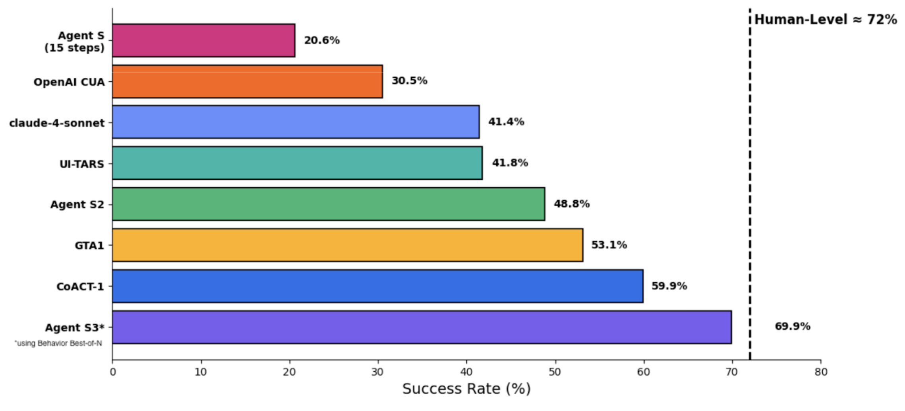

<h1 align="center">
   Agent S:
  <small>Use Computer Like a Human</small>
</h1>

<p align="center">&nbsp;
  🌐 <a href="https://www.simular.ai/articles/agent-s3">[S3 blog]</a>&nbsp;
  📄 <a href="https://arxiv.org/abs/2510.02250">[S3 Paper]</a>&nbsp;
  🎥 <a href="https://www.youtube.com/watch?v=VHr0a3UBsh4">[S3 Video]</a>
</p>

<p align="center">&nbsp;
  🌐 <a href="https://www.simular.ai/articles/agent-s2-technical-review">[S2 blog]</a>&nbsp;
  📄 <a href="https://arxiv.org/abs/2504.00906">[S2 Paper (COLM 2025)]</a>&nbsp;
  🎥 <a href="https://www.youtube.com/watch?v=wUGVQl7c0eg">[S2 Video]</a>
</p>

<p align="center">&nbsp;
  🌐 <a href="https://www.simular.ai/agent-s">[S1 blog]</a>&nbsp;
  📄 <a href="https://arxiv.org/abs/2410.08164">[S1 Paper (ICLR 2025)]</a>&nbsp;
  🎥 <a href="https://www.youtube.com/watch?v=OBDE3Knte0g">[S1 Video]</a>
</p>

<p align="center">&nbsp;
<a href="https://trendshift.io/repositories/13151" target="_blank"></a>
</p>

<p align="center">
  
  
  
  <a href="https://discord.gg/E2XfsK9fPV">
    
  </a>
  &nbsp;&nbsp;
  <a href="https://pepy.tech/projects/gui-agents">
    
  </a>
</p>

<div align="center">
  <!-- Keep these links. Translations will automatically update with the README. -->
  <a href="https://www.readme-i18n.com/simular-ai/Agent-S?lang=de">Deutsch</a> | 
  <a href="https://www.readme-i18n.com/simular-ai/Agent-S?lang=es">Español</a> | 
  <a href="https://www.readme-i18n.com/simular-ai/Agent-S?lang=fr">français</a> | 
  <a href="https://www.readme-i18n.com/simular-ai/Agent-S?lang=ja">日本語</a> | 
  <a href="https://www.readme-i18n.com/simular-ai/Agent-S?lang=ko">한국어</a> | 
  <a href="https://www.readme-i18n.com/simular-ai/Agent-S?lang=pt">Português</a> | 
  <a href="https://www.readme-i18n.com/simular-ai/Agent-S?lang=ru">Русский</a> | 
  <a href="https://www.readme-i18n.com/simular-ai/Agent-S?lang=zh">中文</a>
</div>

<div align="center">
  &nbsp;&nbsp;
<p>Skip the setup? Try Agent S in <a href="https://cloud.simular.ai/">Simular Cloud</a>
</div>

## 🥳 Updates
- [x] **2025/10/02**: Released Agent S3 and its [technical paper](https://arxiv.org/abs/2510.02250), setting a new SOTA of **69.9%** on OSWorld (approaching 72% human performance), with strong generalizability on WindowsAgentArena and AndroidWorld! It is also simpler, faster, and more flexible.
- [x] **2025/08/01**: Agent S2.5 is released (gui-agents v0.2.5): simpler, better, and faster! New SOTA on [OSWorld-Verified](https://os-world.github.io)!
- [x] **2025/07/07**: The [Agent S2 paper](https://arxiv.org/abs/2504.00906) is accepted to COLM 2025! See you in Montreal!
- [x] **2025/04/27**: The Agent S paper won the Best Paper Award 🏆 at ICLR 2025 Agentic AI for Science Workshop!
- [x] **2025/04/01**: Released the [Agent S2 paper](https://arxiv.org/abs/2504.00906) with new SOTA results on OSWorld, WindowsAgentArena, and AndroidWorld!
- [x] **2025/03/12**: Released Agent S2 along with v0.2.0 of [gui-agents](https://github.com/simular-ai/Agent-S), the new state-of-the-art for computer use agents (CUA), outperforming OpenAI's CUA/Operator and Anthropic's Claude 3.7 Sonnet Computer-Use!
- [x] **2025/01/22**: The [Agent S paper](https://arxiv.org/abs/2410.08164) is accepted to ICLR 2025!
- [x] **2025/01/21**: Released v0.1.2 of [gui-agents](https://github.com/simular-ai/Agent-S) library, with support for Linux and Windows!
- [x] **2024/12/05**: Released v0.1.0 of [gui-agents](https://github.com/simular-ai/Agent-S) library, allowing you to use Agent-S for Mac, OSWorld, and WindowsAgentArena with ease!
- [x] **2024/10/10**: Released the [Agent S paper](https://arxiv.org/abs/2410.08164) and codebase!

## Table of Contents

1. [💡 Introduction](#-introduction)
2. [🎯 Current Results](#-current-results)
3. [🛠️ Installation & Setup](#%EF%B8%8F-installation--setup) 
4. [🚀 Usage](#-usage)
5. [🤝 Acknowledgements](#-acknowledgements)
6. [💬 Citation](#-citation)

## 💡 Introduction

Welcome to **Agent S**, an open-source framework designed to enable autonomous interaction with computers through Agent-Computer Interface. Our mission is to build intelligent GUI agents that can learn from past experiences and perform complex tasks autonomously on your computer. 

Whether you're interested in AI, automation, or contributing to cutting-edge agent-based systems, we're excited to have you here!

## 🎯 Current Results

<p align="center">
  
</p>

On OSWorld, Agent S3 alone reaches 62.6% in the 100-step setting, already exceeding the previous state of the art of 61.4% (Claude Sonnet 4.5). With the addition of Behavior Best-of-N, performance climbs even higher to 69.9%, bringing computer-use agents to within just a few points of human-level accuracy (72%).

Agent S3 also demonstrates strong zero-shot generalization. On WindowsAgentArena, accuracy rises from 50.2% using only Agent S3 to 56.6% by selecting from 3 rollouts. Similarly on AndroidWorld, performance improves from 68.1% to 71.6%

## 🛠️ Installation & Setup

### Prerequisites
- **Single Monitor**: Our agent is designed for single monitor screens
- **Security**: The agent runs Python code to control your computer - use with care
- **Supported Platforms**: Linux, Mac, and Windows


### Installation
To install Agent S3 without cloning the repository, run
```bash
pip install gui-agents
```
If you would like to test Agent S3 while making changes, clone the repository and install using
```
pip install -e .
```

Don't forget to also `brew install tesseract`! Pytesseract requires this extra installation to work.

### API Configuration

#### Option 1: Environment Variables
Add to your `.bashrc` (Linux) or `.zshrc` (MacOS):
```bash
export OPENAI_API_KEY=<YOUR_API_KEY>
export ANTHROPIC_API_KEY=<YOUR_ANTHROPIC_API_KEY>
export HF_TOKEN=<YOUR_HF_TOKEN>
```

#### Option 2: Python Script
```python
import os
os.environ["OPENAI_API_KEY"] = "<YOUR_API_KEY>"
```

### Supported Models
We support Azure OpenAI, Anthropic, Gemini, Open Router, and vLLM inference. See [models.md](models.md) for details.

### Grounding Models (Required)
For optimal performance, we recommend [UI-TARS-1.5-7B](https://huggingface.co/ByteDance-Seed/UI-TARS-1.5-7B) hosted on Hugging Face Inference Endpoints or another provider. See [Hugging Face Inference Endpoints](https://huggingface.co/learn/cookbook/en/enterprise_dedicated_endpoints) for setup instructions.

## 🚀 Usage


> ⚡️ **Recommended Setup:**  
> For the best configuration, we recommend using **OpenAI gpt-5-2025-08-07** as the main model, paired with **UI-TARS-1.5-7B** for grounding.  


### CLI

Note, this is running Agent S3, our improved agent, without bBoN. 

Run Agent S3 with the required parameters:

```bash
agent_s \
    --provider openai \
    --model gpt-5-2025-08-07 \
    --ground_provider huggingface \
    --ground_url http://localhost:8080 \
    --ground_model ui-tars-1.5-7b \
    --grounding_width 1920 \
    --grounding_height 1080
```

#### Local Coding Environment (Optional)
For tasks that require code execution (e.g., data processing, file manipulation, system automation), you can enable the local coding environment:

```bash
agent_s \
    --provider openai \
    --model gpt-5-2025-08-07 \
    --ground_provider huggingface \
    --ground_url http://localhost:8080 \
    --ground_model ui-tars-1.5-7b \
    --grounding_width 1920 \
    --grounding_height 1080 \
    --enable_local_env
```

⚠️ **WARNING**: The local coding environment executes arbitrary Python and Bash code locally on your machine. Only use this feature in trusted environments and with trusted inputs.

#### Required Parameters
- **`--provider`**: Main generation model provider (e.g., openai, anthropic, etc.) - Default: "openai"
- **`--model`**: Main generation model name (e.g., gpt-5-2025-08-07) - Default: "gpt-5-2025-08-07"
- **`--ground_provider`**: The provider for the grounding model - **Required**
- **`--ground_url`**: The URL of the grounding model - **Required**
- **`--ground_model`**: The model name for the grounding model - **Required**
- **`--grounding_width`**: Width of the output coordinate resolution from the grounding model - **Required**
- **`--grounding_height`**: Height of the output coordinate resolution from the grounding model - **Required**

#### Optional Parameters
- **`--model_temperature`**: The temperature to fix all model calls to (necessary to set to 1.0 for models like o3 but can be left blank for other models)

#### Grounding Model Dimensions
The grounding width and height should match the output coordinate resolution of your grounding model:
- **UI-TARS-1.5-7B**: Use `--grounding_width 1920 --grounding_height 1080`
- **UI-TARS-72B**: Use `--grounding_width 1000 --grounding_height 1000`

#### Optional Parameters
- **`--model_url`**: Custom API URL for main generation model - Default: ""
- **`--model_api_key`**: API key for main generation model - Default: ""
- **`--ground_api_key`**: API key for grounding model endpoint - Default: ""
- **`--max_trajectory_length`**: Maximum number of image turns to keep in trajectory - Default: 8
- **`--enable_reflection`**: Enable reflection agent to assist the worker agent - Default: True
- **`--enable_local_env`**: Enable local coding environment for code execution (WARNING: Executes arbitrary code locally) - Default: False

#### Local Coding Environment Details
The local coding environment enables Agent S3 to execute Python and Bash code directly on your machine. This is particularly useful for:

- **Data Processing**: Manipulating spreadsheets, CSV files, or databases
- **File Operations**: Bulk file processing, content extraction, or file organization
- **System Automation**: Configuration changes, system setup, or automation scripts
- **Code Development**: Writing, editing, or executing code files
- **Text Processing**: Document manipulation, content editing, or formatting

When enabled, the agent can use the `call_code_agent` action to execute code blocks for tasks that can be completed through programming rather than GUI interaction.

**Requirements:**
- **Python**: The same Python interpreter used to run Agent S3 (automatically detected)
- **Bash**: Available at `/bin/bash` (standard on macOS and Linux)
- **System Permissions**: The agent runs with the same permissions as the user executing it

**Security Considerations:**
- The local environment executes arbitrary code with the same permissions as the user running the agent
- Only enable this feature in trusted environments
- Be cautious when the agent generates code for system-level operations
- Consider running in a sandboxed environment for untrusted tasks
- Bash scripts are executed with a 30-second timeout to prevent hanging processes

### `gui_agents` SDK

First, we import the necessary modules. `AgentS3` is the main agent class for Agent S3. `OSWorldACI` is our grounding agent that translates agent actions into executable python code.
```python
import pyautogui
import io
from gui_agents.s3.agents.agent_s import AgentS3
from gui_agents.s3.agents.grounding import OSWorldACI
from gui_agents.s3.utils.local_env import LocalEnv  # Optional: for local coding environment

# Load in your API keys.
from dotenv import load_dotenv
load_dotenv()

current_platform = "linux"  # "darwin", "windows"
```

Next, we define our engine parameters. `engine_params` is used for the main agent, and `engine_params_for_grounding` is for grounding. For `engine_params_for_grounding`, we support custom endpoints like HuggingFace TGI, vLLM, and Open Router.

```python
engine_params = {
  "engine_type": provider,
  "model": model,
  "base_url": model_url,           # Optional
  "api_key": model_api_key,        # Optional
  "temperature": model_temperature # Optional
}

# Load the grounding engine from a custom endpoint
ground_provider = "<your_ground_provider>"
ground_url = "<your_ground_url>"
ground_model = "<your_ground_model>"
ground_api_key = "<your_ground_api_key>"

# Set grounding dimensions based on your model's output coordinate resolution
# UI-TARS-1.5-7B: grounding_width=1920, grounding_height=1080
# UI-TARS-72B: grounding_width=1000, grounding_height=1000
grounding_width = 1920  # Width of output coordinate resolution
grounding_height = 1080  # Height of output coordinate resolution

engine_params_for_grounding = {
  "engine_type": ground_provider,
  "model": ground_model,
  "base_url": ground_url,
  "api_key": ground_api_key,  # Optional
  "grounding_width": grounding_width,
  "grounding_height": grounding_height,
}
```

Then, we define our grounding agent and Agent S3.

```python
# Optional: Enable local coding environment
enable_local_env = False  # Set to True to enable local code execution
local_env = LocalEnv() if enable_local_env else None

grounding_agent = OSWorldACI(
    env=local_env,  # Pass local_env for code execution capability
    platform=current_platform,
    engine_params_for_generation=engine_params,
    engine_params_for_grounding=engine_params_for_grounding,
    width=1920,  # Optional: screen width
    height=1080  # Optional: screen height
)

agent = AgentS3(
    engine_params,
    grounding_agent,
    platform=current_platform,
    max_trajectory_length=8,  # Optional: maximum image turns to keep
    enable_reflection=True     # Optional: enable reflection agent
)
```

Finally, let's query the agent!

```python
# Get screenshot.
screenshot = pyautogui.screenshot()
buffered = io.BytesIO() 
screenshot.save(buffered, format="PNG")
screenshot_bytes = buffered.getvalue()

obs = {
  "screenshot": screenshot_bytes,
}

instruction = "Close VS Code"
info, action = agent.predict(instruction=instruction, observation=obs)

exec(action[0])
```

Refer to `gui_agents/s3/cli_app.py` for more details on how the inference loop works.

### OSWorld

To deploy Agent S3 in OSWorld, follow the [OSWorld Deployment instructions](osworld_setup/s3/OSWorld.md).

## 💬 Citations

If you find this codebase useful, please cite:

```
@misc{Agent-S3,
      title={The Unreasonable Effectiveness of Scaling Agents for Computer Use}, 
      author={Gonzalo Gonzalez-Pumariega and Vincent Tu and Chih-Lun Lee and Jiachen Yang and Ang Li and Xin Eric Wang},
      year={2025},
      eprint={2510.02250},
      archivePrefix={arXiv},
      primaryClass={cs.AI},
      url={https://arxiv.org/abs/2510.02250}, 
}

@misc{Agent-S2,
      title={Agent S2: A Compositional Generalist-Specialist Framework for Computer Use Agents}, 
      author={Saaket Agashe and Kyle Wong and Vincent Tu and Jiachen Yang and Ang Li and Xin Eric Wang},
      year={2025},
      eprint={2504.00906},
      archivePrefix={arXiv},
      primaryClass={cs.AI},
      url={https://arxiv.org/abs/2504.00906}, 
}

@inproceedings{Agent-S,
    title={{Agent S: An Open Agentic Framework that Uses Computers Like a Human}},
    author={Saaket Agashe and Jiuzhou Han and Shuyu Gan and Jiachen Yang and Ang Li and Xin Eric Wang},
    booktitle={International Conference on Learning Representations (ICLR)},
    year={2025},
    url={https://arxiv.org/abs/2410.08164}
}
```

## Star History

[](https://star-history.com/#simular-ai/Agent-S&Date)
