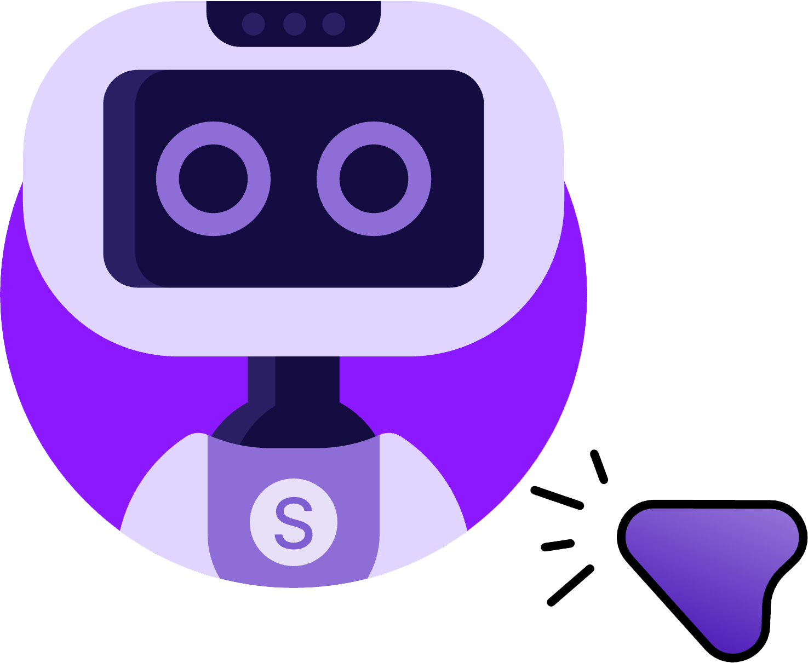
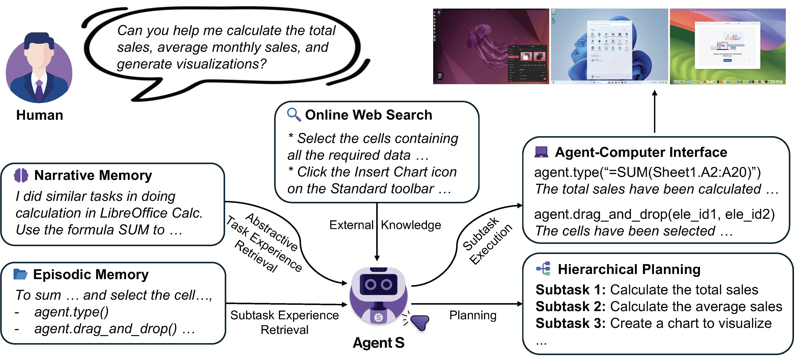
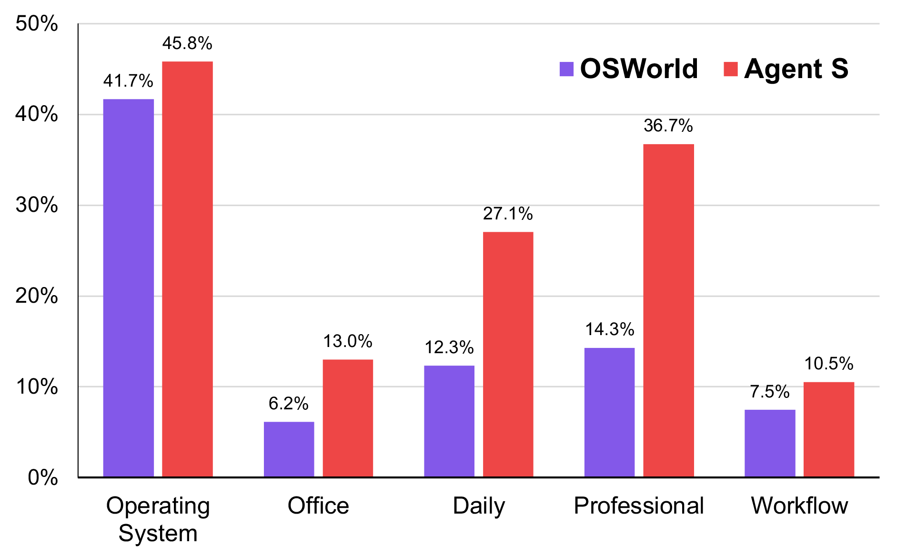

<h1 align="center">
   Agent S:
  <small>Using Computers Like a Human</small>
</h1>

<p align="center">
  🌐 <a href="https://www.simular.ai/agent-s">[Website]</a>
  📄 <a href="https://arxiv.org/abs/2410.08164">[Paper]</a>
  🎥 <a href="https://www.youtube.com/watch?v=OBDE3Knte0g">[Video]</a>
  🗨️ <a href="https://discord.gg/E2XfsK9fPV">[Discord]</a>
</p>

## 🥳 Updates
- [x] **2025/01/22**: The [Agent S paper](https://arxiv.org/abs/2410.08164) is accepted to ICLR 2025!
- [x] **2025/01/21**: Released v0.1.2 of [gui-agents](https://github.com/simular-ai/Agent-S) library, with support for Linux and Windows!
- [x] **2024/12/05**: Released v0.1.0 of [gui-agents](https://github.com/simular-ai/Agent-S) library, allowing you to use Agent-S for Mac, OSWorld, and WindowsAgentArena with ease!
- [x] **2024/10/10**: Released [Agent S paper](https://arxiv.org/abs/2410.08164) and codebase!

## Table of Contents

1. [💡 Introduction](#-introduction)
2. [🎯 Current Results](#-current-results)
3. [🛠️ Installation](#%EF%B8%8F-installation) 
4. [🚀 Usage](#-usage)
5. [🙌 Contributors](#-contributors)
6. [💬 Citation](#-citation)

## 💡 Introduction

<p align="center">
    
</p>

Welcome to **Agent S**, an open-source framework designed to enable autonomous interaction with computers through Agent-Computer Interface. Our mission is to build intelligent GUI agents that can learn from past experiences and perform complex tasks autonomously on your computer. 

Whether you're interested in AI, automation, or contributing to cutting-edge agent-based systems, we're excited to have you here!

## 🎯 Current Results

<p align="center">
    
    <br>
    Results of Successful Rate (%) on the OSWorld full test set of all 369 test examples using Image + Accessibility Tree input.
</p>


## 🛠️ Installation & Setup

> ❗**Warning**❗: If you are on a Linux machine, creating a `conda` environment will interfere with `pyatspi`. As of now, there's no clean solution for this issue. Proceed through the installation without using `conda` or any virtual environment.

Clone the repository:
```
git clone https://github.com/simular-ai/Agent-S.git
```

Install the gui-agents package:
```
pip install gui-agents
```

Set your LLM API Keys and other environment variables. You can do this by adding the following line to your .bashrc (Linux), or .zshrc (MacOS) file. 

```
export OPENAI_API_KEY=<YOUR_API_KEY>
```

Alternatively, you can set the environment variable in your Python script:

```
import os
os.environ["OPENAI_API_KEY"] = "<YOUR_API_KEY>"
```

We also support Azure OpenAI, Anthropic, and vLLM inference. For more information refer to [../../models.md](models.md).

### Setup Retrieval from Web using Perplexica
Agent S works best with web-knowledge retrieval. To enable this feature, you need to setup Perplexica: 

1. Ensure Docker Desktop is installed and running on your system.

2. Navigate to the directory containing the project files.

   ```bash
    cd Perplexica
    git submodule update --init
   ```

3. Rename the `sample.config.toml` file to `config.toml`. For Docker setups, you need only fill in the following fields:

   - `OPENAI`: Your OpenAI API key. **You only need to fill this if you wish to use OpenAI's models**.
   - `OLLAMA`: Your Ollama API URL. You should enter it as `http://host.docker.internal:PORT_NUMBER`. If you installed Ollama on port 11434, use `http://host.docker.internal:11434`. For other ports, adjust accordingly. **You need to fill this if you wish to use Ollama's models instead of OpenAI's**.
   - `GROQ`: Your Groq API key. **You only need to fill this if you wish to use Groq's hosted models**.
   - `ANTHROPIC`: Your Anthropic API key. **You only need to fill this if you wish to use Anthropic models**.

     **Note**: You can change these after starting Perplexica from the settings dialog.

   - `SIMILARITY_MEASURE`: The similarity measure to use (This is filled by default; you can leave it as is if you are unsure about it.)

4. Ensure you are in the directory containing the `docker-compose.yaml` file and execute:

   ```bash
   docker compose up -d
   ```

5. Next, export your Perplexica URL. This URL is used to interact with the Perplexica API backend. The port is given by the `config.toml` in your Perplexica directory.

   ```bash
   export PERPLEXICA_URL=http://localhost:{port}/api/search
   ```

6. Our implementation of Agent S incorporates the Perplexica API to integrate a search engine capability, which allows for a more convenient and responsive user experience. If you want to tailor the API to your settings and specific requirements, you may modify the URL and the message of request parameters in  `agent_s/query_perplexica.py`. For a comprehensive guide on configuring the Perplexica API, please refer to [Perplexica Search API Documentation](https://github.com/ItzCrazyKns/Perplexica/blob/master/docs/API/SEARCH.md)

For a more detailed setup and usage guide, please refer to the [Perplexica Repository](https://github.com/ItzCrazyKns/Perplexica.git).

### Setup Paddle-OCR Server

Switch to a new terminal where you will run Agent S. Set the OCR_SERVER_ADDRESS environment variable as shown below. For a better experience, add the following line directly to your .bashrc (Linux), or .zshrc (MacOS) file.

```
export OCR_SERVER_ADDRESS=http://localhost:8000/ocr/
```

Run the ocr_server.py file code to use OCR-based bounding boxes.

```
cd Agent-S
python gui_agents/utils/ocr_server.py
```

You can change the server address by editing the address in [gui_agents/s1/utils/ocr_server.py](utils/ocr_server.py) file.


> ❗**Warning**❗: The agent will directly run python code to control your computer. Please use with care.

## 🚀 Usage

### CLI

Run agent_s on your computer using:  
```
agent_s1 --model gpt-4o
```
This will show a user query prompt where you can enter your query and interact with Agent S. You can use any model from the list of supported models in [models.md](../../models.md).

### `gui_agents` SDK

To deploy Agent S on MacOS or Windows:

```
import pyautogui
import io
from gui_agents.core.AgentS import GraphSearchAgent
import platform

if platform.system() == "Darwin":
  from gui_agents.aci.MacOSACI import MacOSACI, UIElement
  grounding_agent = MacOSACI()
elif platform.system() == "Windows":
  from gui_agents.aci.WindowsOSACI import WindowsACI, UIElement
  grounding_agent = WindowsACI()
elif platform.system() == "Linux":
  from gui_agents.aci.LinuxOSACI import LinuxACI, UIElement
  grounding_agent = LinuxACI()
else:
  raise ValueError("Unsupported platform")

engine_params = {
    "engine_type": "openai",
    "model": "gpt-4o",
}

agent = GraphSearchAgent(
  engine_params,
  grounding_agent,
  platform="ubuntu",  # "macos", "windows"
  action_space="pyautogui",
  observation_type="mixed",
  search_engine="Perplexica"
)

# Get screenshot.
screenshot = pyautogui.screenshot()
buffered = io.BytesIO() 
screenshot.save(buffered, format="PNG")
screenshot_bytes = buffered.getvalue()

# Get accessibility tree.
acc_tree = UIElement.systemWideElement()

obs = {
  "screenshot": screenshot_bytes,
  "accessibility_tree": acc_tree,
}

instruction = "Close VS Code"
info, action = agent.predict(instruction=instruction, observation=obs)

exec(action[0])
```

Refer to `cli_app.py` for more details on how the inference loop works.

#### Downloading the Knowledege Base

Agent S2 uses a knowledge base that continually updates with new knowledge during inference. The knowledge base is initially downloaded when initializing `GraphSearchAgent`. The knowledge base is stored as assets under our [GitHub Releases](https://github.com/simular-ai/Agent-S/releases). The `GraphSearchAgent` initialization will only download the knowledge base for your specified platform and agent version (e.g s1, s2). If you'd like to download the knowledge base programmatically, you can use the following code:

```
download_kb_data(
    version="s2",
    release_tag="v0.2.2",
    download_dir="kb_data",
    platform="linux"  # "darwin", "windows"
)
```

This will download Agent S2's knowledge base for Linux from release tag `v0.2.2` to the `kb_data` directory. Refer to our [GitHub Releases](https://github.com/simular-ai/Agent-S/releases) or release tags that include the knowledge bases.

### OSWorld

To deploy Agent S in OSWorld, follow the [OSWorld Deployment instructions](OSWorld.md).

### WindowsAgentArena

To deploy Agent S in WindowsAgentArena, follow the [WindowsAgentArena Deployment instructions](WindowsAgentArena.md).

## 🙌 Contributors

We’re grateful to all the [amazing people](https://github.com/simular-ai/Agent-S/graphs/contributors) who have contributed to this project. Thank you! 🙏  

## 💬 Citation
```
@misc{agashe2024agentsopenagentic,
      title={Agent S: An Open Agentic Framework that Uses Computers Like a Human}, 
      author={Saaket Agashe and Jiuzhou Han and Shuyu Gan and Jiachen Yang and Ang Li and Xin Eric Wang},
      year={2024},
      eprint={2410.08164},
      archivePrefix={arXiv},
      primaryClass={cs.AI},
      url={https://arxiv.org/abs/2410.08164}, 
}
```

